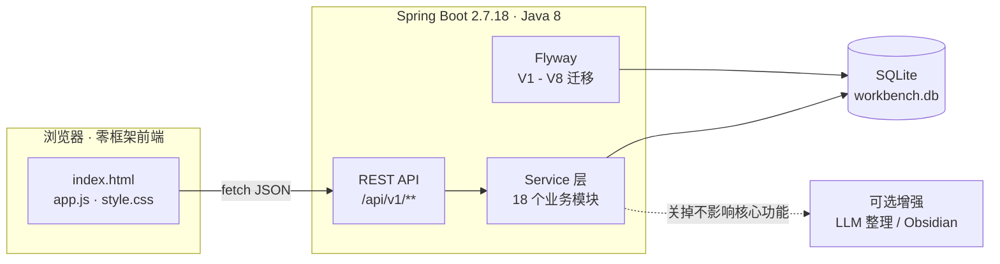

# 个人工作台 · Personal Workbench

> **一个纯本地、单用户、断网可用的 Windows 个人工作台。**
> 脑子里冒出来的事 5 秒记下来，系统帮你分好类，每天早上打开就知道今天先干什么。

[](#技术栈)
[](#技术栈)
[](#技术栈)
[](#技术栈)
[](LICENSE)

---

## 这是什么

给每天要处理大量碎片事务的人，做一个**装在自己电脑上、不用联网、解压即用**的个人工作台。

它**不是一个待办清单 App**。市面上待办工具失败的原因不是功能不够，而是**录入太慢**：打开 App、选清单、填标题、设日期、选优先级——五步之后，那件事已经忘了。

本项目的全部设计都围绕一个目标：

> **把「记录一件事」的摩擦降到接近零，把「决定今天先做什么」的成本降到零。**

### 三条不可妥协的产品原则

| 原则 | 含义 | 违反的代价 |
|---|---|---|
| **P1 零摩擦录入** | 一句话、一个回车、进收集箱。不要求当场分类、定优先级、选日期 | 用户不用了，因为记一条太麻烦 |
| **P2 每天 15 分钟清空** | 收集箱必须能快速清空，而不是越积越多 | 收集箱变成第二个垃圾桶 |
| **P3 本地优先、可复制** | 一台没装任何开发环境的 Windows 电脑，解压即用；数据只在本机 | 无法交付给他人，产品失去传播价值 |

### 三条产品定义约束

任何需求与它冲突时以此为准：

1. **纯本地** — 不依赖任何公网服务；AI 是可选增强，关掉后核心功能 100% 可用
2. **单用户** — 无多账号、无协作、无权限体系；登录口令只防家人误触
3. **无需网络** — 断网状态下除 AI 整理外，所有功能正常

---

## 功能一览

| 模块 | 说明 |
|---|---|
| **收集箱** | 一句话回车即入库，不做任何分类要求。可接本地规则或 LLM 自动整理为任务/日程/收藏/知识四类 |
| **驾驶舱** | 今日聚焦：只推 Top 3，六个指标全部可下钻；附今日番茄钟与每日计划 |
| **任务看板** | 待办 / 进行中 / 已完成三泳道，拖动即改状态，严格后端状态机 |
| **日程周视图** | 纵向「下一周 / 本周 / 上一周」三段手风琴，任何时刻只展开一周；支持待定时间区与重复日程 |
| **收藏** | 工作 / 生活分组、主题配色、置顶、全文检索；标题与正文至少写一项即可 |
| **知识库** | 收录知识条目，对接本地 Obsidian 仓库，支持 AI 问答（可选增强） |
| **全局搜索** | 顶栏常驻入口，跨五类实体 + 回收站，左列表右预览分栏，支持语义联想 |
| **番茄钟** | 单次时长与休息可配，计入驾驶舱今日统计 |
| **回收站** | 任务 / 日程 / 收藏 / 知识 / 收录五类软删统一入回收站，保留 30 天可恢复 |
| **时间线** | 全量操作流水（`activity_log`），物理删除需二次确认 |
| **跨实体搬运** | 一条记录在任务↔日程↔收藏↔知识之间转移，一个事务内完成「新建 + 软删 + 记流水」，有损字段明确告警 |
| **备份与恢复** | 每日自动备份 + 手动备份 / 恢复，SQLite 连接池挂起式安全替换 |

---

## 技术栈

| 层 | 选型 | 理由 |
|---|---|---|
| 运行时 | **Java 8** | 免安装包需自带 JRE，JRE 8 体积与兼容性最优 |
| 框架 | **Spring Boot 2.7.18** | 2.7.x 是最后一个支持 Java 8 的 Spring Boot 主线 |
| 数据库 | **SQLite + HikariCP** | 单文件、零运维；连接池规避 Windows 上单连接固定开销 |
| 迁移 | **Flyway** | 首次启动自动建库，用户无感 |
| 前端 | **原生 HTML / CSS / JS** | 零框架、零构建步骤，免安装包内直接静态托管 |
| 打包 | **Maven Wrapper** | 使用者无需预装 Maven |

**刻意不引入的东西**：Node 构建链、前端框架、Redis、消息队列、Docker（版本 A 不依赖）。

---

## 架构



### 后端模块划分

源码位于 `personal-workbench/server/src/main/java/com/icecode/workbench/`：

```text
auth        登录与首次初始化          schedule   日程（含周视图 / 待定区 / 重复期次）
common      统一响应 / 错误码 / 全局异常   search     全局搜索与语义联想
config      数据源 / WebMvc / 目录初始化  settings   设置（AI / Obsidian / 个人资料）
dashboard   驾驶舱指标与下钻           system     备份与恢复、每日定时备份
demo        演示数据                   task       任务与状态机
inbox       收集箱与 AI 整理            timeline   操作时间线
knowledge   知识库与 Obsidian           transfer   跨实体搬运
favorite        收藏                       trash      回收站
pomodoro    番茄钟                     util       文本 / 时间工具
```

---

## 快速开始

### 方式一：源码运行（开发者）

前置条件：**JDK 8**（必须是 8，`pom.xml` 里有强制校验）+ **Maven 3.8+**（或直接用内置 wrapper）。

```bash
git clone https://github.com/Solomon258/myWorkSpace.git
cd myWorkSpace/personal-workbench/server

# 使用内置 Maven Wrapper，无需预装 Maven
./mvnw spring-boot:run          # Windows: mvnw.cmd spring-boot:run

# 打开 http://localhost:18080
```

启动后访问 `http://localhost:18080`，首次进入会引导完成初始化（用户名 / 密码 / 时区），其余配置可「稍后设置」。

> **端口说明**：默认 **18080**。若被占用，用 `--server.port=你的端口` 覆盖，注意要写在 `-jar` 之后。

### 方式二：免安装包（普通用户）

面向非技术使用者（版本 A）：

```text
1. 拿到 personal-workbench-v1.0.x-win.zip
2. 解压到普通目录（例如 D:\个人工作台）
   ⚠ 不要放桌面 / OneDrive 同步目录
3. 双击「启动工作台.cmd」
   ├─ 自动检查端口占用 / 数据目录权限 / 防止重复启动
   ├─ 首次自动建库（Flyway），用户无感
   └─ 健康检查通过后自动打开浏览器
```

使用者**永远不需要知道** Java、Spring Boot、SQLite、Flyway、Maven 这些词——它们不应出现在交付包的用户可见文本里。

### 构建与测试

```bash
cd personal-workbench/server

./mvnw clean test        # 运行全部单测与集成测试
./mvnw clean package     # 产出 target/workbench.jar
```

打包为 Windows 免安装 ZIP 见 `personal-workbench/deploy/` 与 [`docs/版本A-Windows免安装包落地方案.md`](personal-workbench/docs/版本A-Windows免安装包落地方案.md)。

---

## 目录结构

```text
myWorkSpace/
├── 开发文档-Java8版.md          # 早期技术总纲（已被 personal-workbench/docs/ 下的同名文档取代）
└── personal-workbench/          # 主项目
    ├── server/                  # Spring Boot 后端 + 静态前端
    │   ├── src/main/java/       # 18 个业务模块
    │   ├── src/main/resources/
    │   │   ├── static/          # 零框架前端（index.html / app.js / style.css）
    │   │   └── db/migration/    # Flyway V1 - V8
    │   └── src/test/java/       # 集成测试
    ├── demo/                    # 可交互原型（视觉与交互的事实标准）
    ├── deploy/                  # 启动 / 停止 / 备份 / 打包脚本
    │   ├── docker/              # 版本 B 预留（Dockerfile.dev）
    │   └── scripts/             # 启动器与前端冒烟脚本
    ├── docs/                    # 需求与设计文档
    └── scripts/                 # 辅助校验脚本
```

---

## 文档索引

| 你想知道的 | 看哪份 |
|---|---|
| 这项目是什么、解决什么问题、做到什么程度 | [`docs/产品设计说明.md`](personal-workbench/docs/产品设计说明.md) |
| 数据库表结构、DDL、API 契约、字段名 | [`docs/开发文档-Java8版.md`](personal-workbench/docs/开发文档-Java8版.md) |
| 打包成 ZIP、启动脚本、JRE 裁剪 | [`docs/版本A-Windows免安装包落地方案.md`](personal-workbench/docs/版本A-Windows免安装包落地方案.md) |
| 需求拆解、里程碑与数据模型 | [`docs/P0-MVP需求拆解与数据模型设计.md`](personal-workbench/docs/P0-MVP需求拆解与数据模型设计.md) |
| 全局搜索的设计取舍 | [`docs/全文搜索功能设计.md`](personal-workbench/docs/全文搜索功能设计.md) |
| 日程为何从按日改为周视图 | [`docs/日程周视图设计.md`](personal-workbench/docs/日程周视图设计.md) |
| 干净机验收步骤 | [`docs/干净机验收清单.md`](personal-workbench/docs/干净机验收清单.md) |

> **文档优先级冲突的裁决顺序**：`demo/index.html`（交互与视觉）＞ 产品设计说明（产品规则）＞ 开发文档（技术实现）。

---

## 分支模型

| 分支 | 用途 |
|---|---|
| `main` | 始终保持可发布状态，只接受来自 `develop` 的合并 |
| `develop` | 日常开发集成分支，功能完成后合入 |
| `feature/*` | 单个功能开发，从 `develop` 分出，完成后合并回 `develop` |

提交信息遵循 [Conventional Commits](https://www.conventionalcommits.org/)，详见 [CONTRIBUTING.md](CONTRIBUTING.md)。

---

## 贡献

欢迎提交 Issue 与 Pull Request。开始之前请阅读：

- [CONTRIBUTING.md](CONTRIBUTING.md) — 开发环境、分支模型、代码规范
- [CODE_OF_CONDUCT.md](CODE_OF_CONDUCT.md) — 社区行为准则
- [SECURITY.md](SECURITY.md) — 如何私密报告安全问题

---

## 许可证

本项目基于 [MIT License](LICENSE) 开源。
